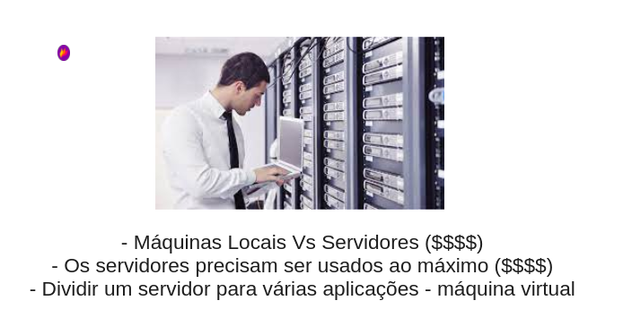
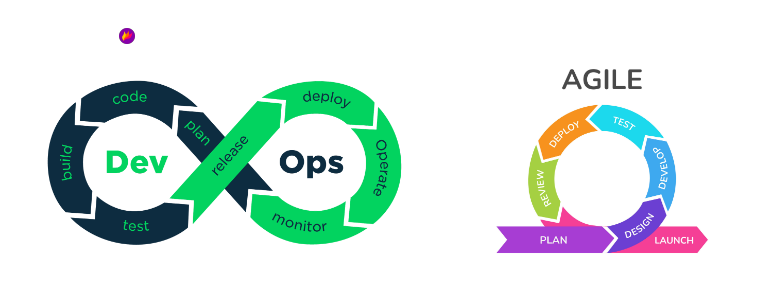
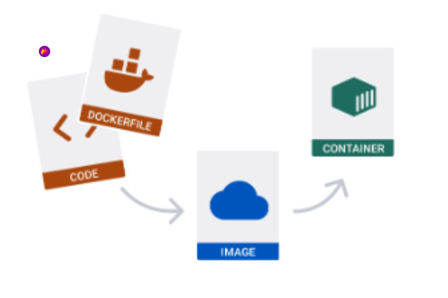
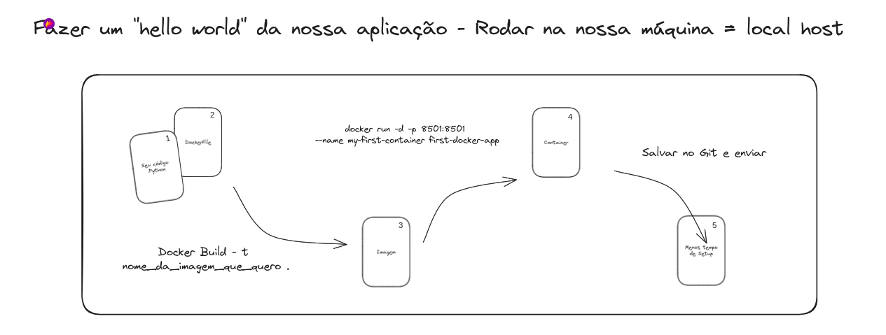
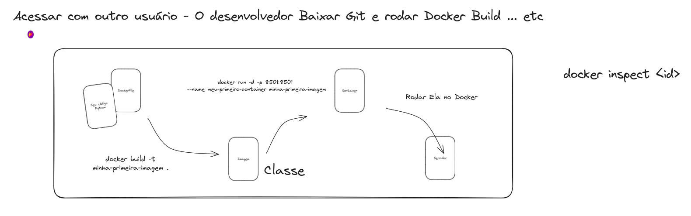
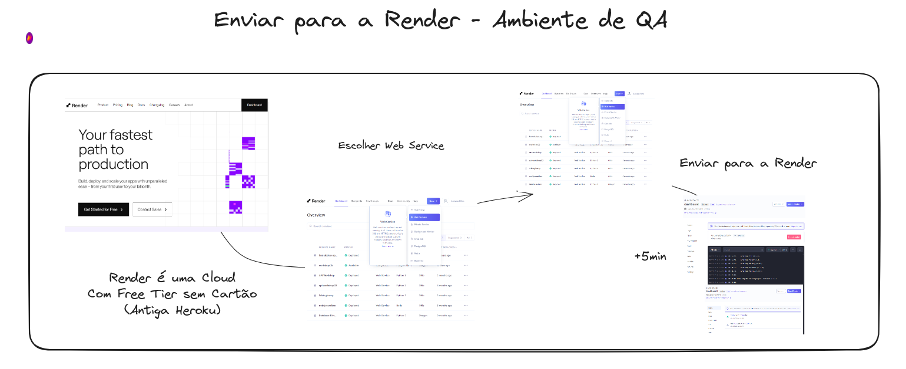
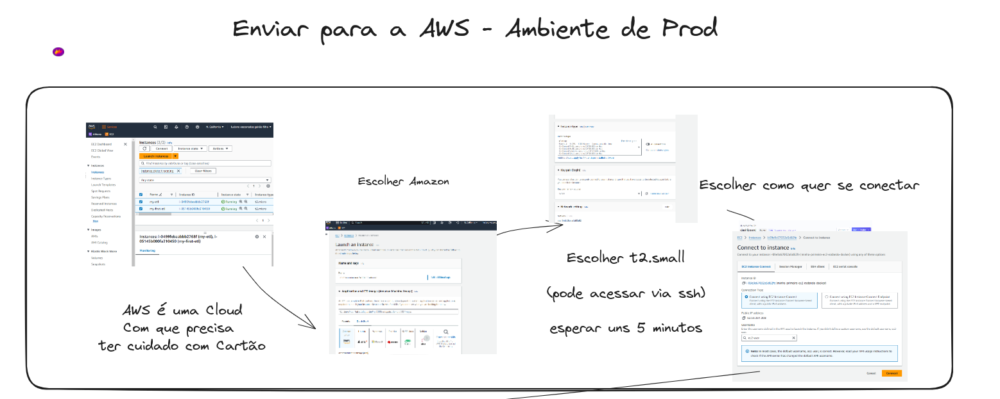
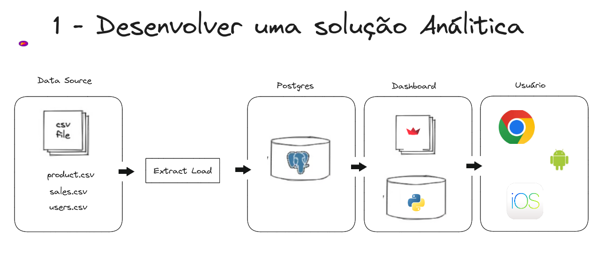

# Porque estudar DOCKER ?

- Fazer virtualização de várias máquinas;
- Aplicação funcionar em um ambiente padronizado;
- Máquina virtual simples, leve e fácil de instalar e funcionar.
- Docker: utilizar o computador da melhor possível.




### Qual a diferença de Docker para a VM?

- VM, é realmente um computador novo. Precisa configurar tudo. Temos a camada do Hypervisor e para cada máquina virtual temos a necessidade de instalar um S.O.

- Docker, é focado na aplicação. Computador muito mais leve em termos de recursos. A engine Docker fica em apenas um S.O.



## Passo a passo para instalação do Docker.

Link do youtube:

## Três conceitos do Docker





1 - Code: Código da aplicação, que no nosso caso é a aplicação python. (Aqui na live foi a instalação e configuração do ambiente e um hello world no streamlit);

2 - DockerFile: Criar o Docker File na pasta do projeto onde temos o arquivo python. Dockerfile tem a forma de escrever padronizada, chamada Open CI (Open Container Iniciative). Sequência de execuções que desejamos que seja feito no processo de instalação. Para isso, já temos uma Docker com imagem pronta Python. Executar o Docker File, é um passo antes da criação do container.

2.1 - No Docker file informar o seguinte código:

```python
FROM python: 3.12
```

Segundo comando:

```bash
RUN pip install poetry
```

```bash
COPY . /src
```

Mudar de pasta, que é o WorkDir. Mudar para a pasta src.

```bash
WORKDIR /src
```


```bash
RUN poetry install
```

###ATENÇÃO: No projeto do Visual Code é necessário criar um arquivo Docker ignore.


2.2 - Redes no Docker.

- Subir a aplicação que está no Docker e seja disponível na sua máquina local.

```bash
EXPOSE 8501
```

```bash
ENTRYPOINT ["<Comandos a serem executandos para criar o container>"]
```

3 - Após a criação do Docker File, agora vamos fazer um Build do Docker. Seria uma espécie de fazer um zip para depois criar o container.

Comando para fazer o Build (O ponto aqui é para informar o local do Docker File. Com já está na pasta raiz, não precisa fazer muita coisa):

```bash
docker build -t minha-primeira-imagem .
```

Quando você cria a sua imagem, ele aparecer no Docker Desktop da sua máquina.

A minha imagem é o Build do meu código app e o meu docker file.

4 - Como fazer o unzip do seu build ?

Como saber se a porta está em uso no Linux ? Usar o comando lsof.

No Windows:

netstat -ano | findstr: 8501


```bash
docker run -d -p 8501:8501 --name my-first-container minha-primeira-imagem
#####
<-d é para fazer o deatch do terminal, rodar em segundo plano. A porta 8501 do docker nesse caso vai ser disponibilizada na porta 8501 do seu computador local>
###
```



Fazendo na minha máquina local


### Como fazer o pull do docker no git hub na máquina de outra pessoa

1 - Ir no repositório onde temos o code e a imagem docker. Fazer o GitClone.

2 - Acessar a pasta no Git.

Pegar essa parte no video gravado (Por volta de 1 hora de aula)

Executar o comando Docker build:

```bash
docker build -t minha-primeira-imagem .
```
```bash
docker run -d -p 8501:8501 --name meu-primeiro-container minha-primeira-imagem
```



### Como fazer o uso Docker no site render.com (Espécie de Cloud Free) ?

1 - Acessar o render.com e acessar new (clicar em Web Server ()Free)

2 - Build de repository no github - escolher repositório que tem o dockker file para criar a imagem, container e fazer o build;

3 - Create WebService

4 - Acessar a aba Docker para verificar se ficou com sucesso. Vai aparecer uma url.




### Como fazer o uso do Docker na AWS ?

1 - Acessar para Criar EC2 (Elastic Computer System);

2 - Definir o nome da máquina

3 - Instance type - t2 small - Amazon Linux 2023

4 - Key pair login: ssh e vai baixar um arquivo que será a chave

5 - Liberar acesso http e https

6 - Fazer o Lauch

7 - Acessar a aba de security groups para liberar as portas. edit bound e criar uma regra nova para a porta 8501 >> 0.0.0.0

8 - Reinicar a máquina do EC2 criada.

9 - Fazer o connect.

10 - Fazer esse connect por meio da porta ssh.

11 - Fazer a instalação do docker. Vários comandos que estão no excalidraw que será compartilhado.

    - sudo yum update -y
    - sudo yum install docker -y
    - sudo usermod -a -G docker ec2-user
    - newgrp docker
    - sudo service docker start
    - sudo systemctl enable docker
    - sudo docker run hello-world
    - sudo yum install git -y
    - sudo git clone https://github.com/lvgalvao/dashboard.git
    - cd dashboard
    - sudo docker build -t minha-primeira-imagem .
    - sudo docker run -d -p 8501:8501 --name meu-primeiro-container minha-primeira-imagem
    - sudo docker ps

12 - Ainda no excalidraw, tem o passo a passo para fazer a instalação do git hub.



# Ver no vídeo como que ele fez o fastapi com deploy docker


# Criando o projeto desafio



## Instalando o Postgres no Docker

 - Fazer o download de uma imagem de postgres no Docker Hub que ficar no Docker Desktop;

 - Iniciar a imagem para ficar um container executável com acesso.


## Fazer o Download de uma imagem do PgAdmin4


## Fazer o Docker Compose (Site Medium Renatogroffe)

Link: https://renatogroffe.medium.com/postgresql-pgadmin-4-docker-compose-montando-rapidamente-um-ambiente-para-uso-55a2ab230b89

Passo a passo seguindo o link abaixo, para fazer o Docker Compose.

### ATENÇÃO:  **_Quando usar o Docker Compose ? Quando você precisar de mais de uma imagem ao mesmo tempo._**

Criar o arquivo docker compose .yml:

Código:

```
version: '3'

services:
  teste-postgres-compose:
    image: postgres
    environment:
      POSTGRES_PASSWORD: "Postgres2019!"
    ports:
      - "15432:5432"
    volumes:
      - /home/renatogroffe/Desenvolvimento/Docker-Compose/PostgreSQL:/var/lib/postgresql/data 
    networks:
      - postgres-compose-network
      
  teste-pgadmin-compose:
    image: dpage/pgadmin4
    environment:
      PGADMIN_DEFAULT_EMAIL: "renatogroff@yahoo.com.br"
      PGADMIN_DEFAULT_PASSWORD: "PgAdmin2019!"
    ports:
      - "16543:80"
    depends_on:
      - teste-postgres-compose
    networks:
      - postgres-compose-network

networks: 
  postgres-compose-network:
    driver: bridge
```


Depois fazer o Docker Compose UP:

```bash
docker compose up
```

Na aba do Container, ele vai fazer subir as duas imagens e um mesmo container.

### Fazendo o acesso no PgAdmin4

### Fazendo o Download do Airflow (Exemplo)

### Fazendo Download o compose do AirFlow

-- Curl do docker compose
-- Docker compose up

Seguir a instalação usando o site do airflow.

### Imagem com o Postgres + Streamlit + Banco

- Será um Docker compose.

- Abrir Visual code

- Criar arquivo docker-compose.yml

- Inserir o código do git hub do Luciano.

- Criar pasta app

- Criar arquivo dockerfile

- rodar poetry init no projeto do visual code

- poetry  add streamlit

- potry add pyscopg2 binary

- Rodar o docker compose up


